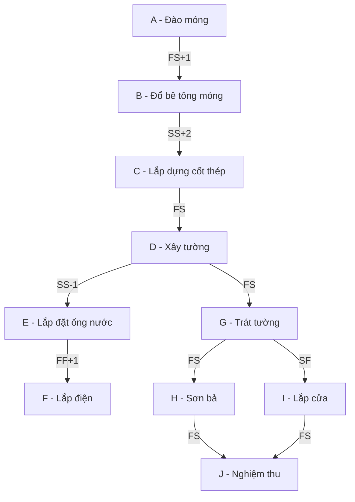

# K-01: SPIKE ĐƯỜNG GĂNG (Tính tay)

## (a) Các quy ước và giải thích công thức

**1. Quy ước thời gian:**
- Ngày bắt đầu sớm nhất của dự án là **Ngày 0** (Tức là $ES_{start} = 0$).
- Quan hệ giữa Ngày bắt đầu (Start) và Ngày kết thúc (Finish): 
  - **$EF = ES + Duration$** (kết thúc vào cuối ngày, hoặc đầu ngày tiếp theo, giúp dễ cộng trừ trễ).
  - Tương tự với duyệt ngược: **$LS = LF - Duration$**.

**2. Công thức duyệt thuận (Forward Pass - Tìm ES, EF):**
1. **FS (Finish-to-Start):** Công việc B chỉ được bắt đầu khi công việc A đã kết thúc. 
   - $ES_B \ge EF_A + delay$
2. **SS (Start-to-Start):** Công việc B chỉ được bắt đầu khi công việc A đã bắt đầu.
   - $ES_B \ge ES_A + delay$
3. **FF (Finish-to-Finish):** Công việc B chỉ được kết thúc khi công việc A đã kết thúc.
   - $EF_B \ge EF_A + delay$  $\rightarrow$ Suy ra: $ES_B = EF_B - Duration_B$
4. **SF (Start-to-Finish):** Công việc B chỉ được kết thúc khi công việc A đã bắt đầu.
   - $EF_B \ge ES_A + delay$  $\rightarrow$ Suy ra: $ES_B = EF_B - Duration_B$

*Lưu ý: Độ trễ (delay) có thể âm (lead time). Tại một nút nếu có nhiều điều kiện tiên quyết, $ES_B$ và $EF_B$ lấy giá trị **MAX** của tất cả các ràng buộc.*

**3. Công thức duyệt ngược (Backward Pass - Tìm LS, LF):**
1. **FS (Finish-to-Start):** Công việc A phải kết thúc trước khi B bắt đầu.
   - $LF_A \le LS_B - delay$
2. **SS (Start-to-Start):** Công việc A phải bắt đầu trước khi B bắt đầu.
   - $LS_A \le LS_B - delay$ $\rightarrow$ Suy ra: $LF_A = LS_A + Duration_A$
3. **FF (Finish-to-Finish):** Công việc A phải kết thúc trước khi B kết thúc.
   - $LF_A \le LF_B - delay$
4. **SF (Start-to-Finish):** Công việc A phải bắt đầu trước khi B kết thúc.
   - $LS_A \le LF_B - delay$ $\rightarrow$ Suy ra: $LF_A = LS_A + Duration_A$

*Lưu ý: Tại một nút duyệt ngược, $LF_A$ và $LS_A$ lấy giá trị **MIN** của tất cả các ràng buộc từ các nút hậu duệ.*

## (b) Đề xuất cấu trúc dữ liệu đồ thị

Sử dụng **danh sách kề hai chiều (Adjacency List) + Bảng bậc vào (In-degree Table)**:
- **Lý do:** Thuật toán duyệt topological sort và duyệt thuận/nghịch cần truy cập nhanh vào danh sách công việc phụ thuộc và các công việc tiên quyết.
- Danh sách kề hai chiều (có link ngược về tiền bối và link xuôi tới hậu duệ) giúp duyệt xuôi (tính ES, EF) và duyệt ngược (tính LS, LF) hiệu quả với độ phức tạp $O(V + E)$.

## (c) Mạng mẫu 10 công việc

| ID | Tên công việc | Thời lượng | Quan hệ tiên quyết | Loại quan hệ | Độ trễ |
|---|---|---|---|---|---|
| A | Đào móng | 5 | - | - | 0 |
| B | Đổ bê tông móng | 3 | A | FS | 1 |
| C | Lắp dựng cốt thép | 4 | B | SS | 2 |
| D | Xây tường | 6 | C | FS | 0 |
| E | Lắp đặt ống nước | 3 | D | SS | -1 (Trễ âm) |
| F | Lắp điện | 4 | E | FF | 1 |
| G | Trát tường | 5 | D | FS | 0 |
| H | Sơn bả | 4 | G | FS | 0 |
| I | Lắp cửa | 2 | G | SF | 0 |
| J | Nghiệm thu | 1 | H, I | FS | 0 |

## (d) Bảng đáp án để trống

| ID | Tên công việc | ES | EF | LS | LF | Float | Găng (Y/N) |
|---|---|---|---|---|---|---|---|
| A | Đào móng | | | | | | |
| B | Đổ bê tông móng | | | | | | |
| C | Lắp dựng cốt thép | | | | | | |
| D | Xây tường | | | | | | |
| E | Lắp đặt ống nước | | | | | | |
| F | Lắp điện | | | | | | |
| G | Trát tường | | | | | | |
| H | Sơn bả | | | | | | |
| I | Lắp cửa | | | | | | |
| J | Nghiệm thu | | | | | | |

## Hướng dẫn cho người dùng tính tay

**Yêu cầu:** 
- Độc giả (con người) vui lòng tự tính toán nháp và điền kết quả vào bảng trên.
- Sau khi điền, hãy tạo (hoặc cập nhật) file JSON kết quả tại: `backend/__tests__/fixtures/critical-path-k01.json`. (Hiện tại file này chưa có hoặc đang trống, chờ bạn điền).

**Thông tin kiểm soát:**
- **Ai tính:** ___
- **Ngày tính:** ___
- **Người kiểm tra chéo (Độc lập):** ___
