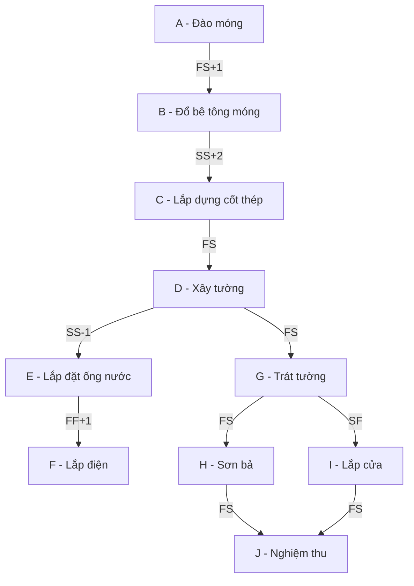

# K-01: SPIKE ĐƯỜNG GĂNG (Tính tay)

## (a) Giải thích công thức

1. **FS (Finish-to-Start):** Công việc B chỉ được bắt đầu khi công việc A đã kết thúc. 
   - $ES_B = \max(EF_A) + delay$
2. **SS (Start-to-Start):** Công việc B chỉ được bắt đầu khi công việc A đã bắt đầu.
   - $ES_B = \max(ES_A) + delay$
3. **FF (Finish-to-Finish):** Công việc B chỉ được kết thúc khi công việc A đã kết thúc.
   - $EF_B = \max(EF_A) + delay$
4. **SF (Start-to-Finish):** Công việc B chỉ được kết thúc khi công việc A đã bắt đầu.
   - $EF_B = \max(ES_A) + delay$

*Ghi chú: Độ trễ (delay) có thể âm (lead time).*

## (b) Đề xuất cấu trúc dữ liệu đồ thị

Sử dụng **danh sách kề hai chiều (Adjacency List) + Bảng bậc vào (In-degree Table)**:
- **Lý do:** Thuật toán duyệt topological sort và duyệt thuận/nghịch cần truy cập nhanh vào danh sách công việc phụ thuộc và các công việc tiên quyết.
- Danh sách kề hai chiều giúp duyệt xuôi (tính ES, EF) và duyệt ngược (tính LS, LF) hiệu quả với độ phức tạp $O(V + E)$.

## (c) Mạng mẫu 10 công việc

| ID | Tên công việc | Thời lượng | Quan hệ tiên quyết | Loại quan hệ | Độ trễ |
|---|---|---|---|---|---|
| A | Đào móng | 5 | - | - | 0 |
| B | Đổ bê tông móng | 3 | A | FS | 1 |
| C | Lắp dựng cốt thép | 4 | B | SS | 2 |
| D | Xây tường | 6 | C | FS | 0 |
| E | Lắp đặt ống nước | 3 | D | SS | -1 (Trễ âm) |
| F | Lắp điện | 4 | E | FF | 1 |
| G | Trát tường | 5 | D | FS | 0 |
| H | Sơn bả | 4 | G | FS | 0 |
| I | Lắp cửa | 2 | G | SF | 0 |
| J | Nghiệm thu | 1 | H, I | FS | 0 |

## (d) Bảng đáp án để trống

| ID | Tên công việc | ES | EF | LS | LF | Float | Găng (Y/N) |
|---|---|---|---|---|---|---|---|
| A | Đào móng | | | | | | |
| B | Đổ bê tông móng | | | | | | |
| C | Lắp dựng cốt thép | | | | | | |
| D | Xây tường | | | | | | |
| E | Lắp đặt ống nước | | | | | | |
| F | Lắp điện | | | | | | |
| G | Trát tường | | | | | | |
| H | Sơn bả | | | | | | |
| I | Lắp cửa | | | | | | |
| J | Nghiệm thu | | | | | | |

Người tính: ___ / Ngày tính: ___ / Người kiểm chéo: ___
