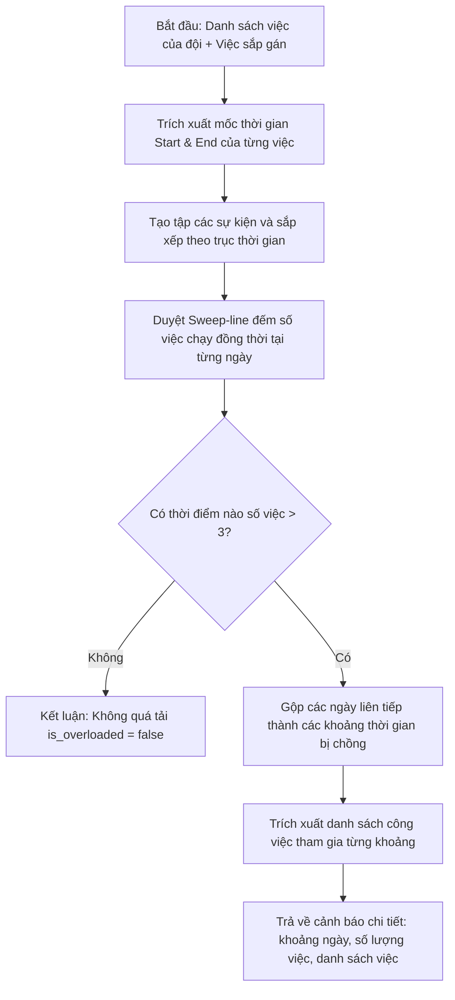

# Kế hoạch thực hiện T-57: Màn hình phân công và cảnh báo quá tải đội

> **Ticket ID:** T-57  
> **Story:** S-25 (Chỉ huy trưởng giao công việc cho đội thi công) — Epic E-11 (Giao việc cho đội và báo cáo từ hiện trường)  
> **Độ phức tạp / SP:** 4  
> **Trạng thái:** ✅ Done (Đã hoàn thành triển khai và kiểm thử)  
> **Đối tượng sử dụng (Actor):** Chỉ huy trưởng công trường (`ROLES.CHI_HUY_TRUONG`)  
> **Ngày hoàn thành:** 10/10/2026  

---

## 1. Mục tiêu & Yêu cầu nghiệp vụ

### 1.1. Mục tiêu (Goal)
Xây dựng màn hình phân công công việc cho các đội thi công trong dự án, tích hợp thuật toán kiểm tra lịch trình và phát hiện quá tải khi một đội có **hơn 3 công việc chồng nhau trong cùng một khoảng thời gian**. Khi phát hiện quá tải, hệ thống phải **cảnh báo rõ khoảng thời gian bị chồng lịch** và danh sách các việc tham gia, đồng thời **vẫn cho phép ghi nhận phân công** theo đúng lựa chọn của Chỉ huy trưởng.

### 1.2. Tiêu chí chấp nhận (Acceptance Criteria - AC)
1. **AC-1 (Phân công việc cho đội):** Chỉ huy trưởng có thể gán công việc trong tiến độ cho một đội thi công. Sau khi gán, đội trưởng và các thành viên của đội thấy công việc đó trong danh sách việc của mình.
2. **AC-2 (Kiểm tra trùng lịch & Cảnh báo quá tải):** Khi một đội đã có các công việc diễn ra đồng thời, việc gán thêm công việc thứ 4 (hoặc bất kỳ việc nào làm tổng số việc chạy song song vượt quá 3) sẽ kích hoạt cảnh báo quá tải:
   - Cảnh báo nêu rõ **khoảng thời gian bị chồng lịch** (Từ ngày `DD/MM/YYYY` đến ngày `DD/MM/YYYY`).
   - Cảnh báo liệt kê **danh sách các công việc** cùng diễn ra trong khoảng thời gian đó.
3. **AC-3 (Vẫn ghi theo quy tắc đã chọn):** Cảnh báo quá tải là dạng cảnh báo mềm (Soft Warning) kèm hộp thoại xác nhận. Khi Chỉ huy trưởng xác nhận "Vẫn giao việc", hệ thống ghi nhận thành công vào cơ sở dữ liệu (`task_assignments`).
4. **AC-4 (Đổi đội & Lưu lịch sử):** Khi chuyển một công việc từ đội cũ sang đội mới, công việc lập tức biến mất khỏi danh sách của đội cũ, xuất hiện ở đội mới và lịch sử thao tác được ghi lại vào `audit_logs`.
5. **AC-5 (Kiểm soát phân quyền - NFR S-25):** Chỉ tài khoản có vai trò `chi_huy_truong` mới có quyền thực hiện phân công công việc và khối lượng kế hoạch. Các vai trò khác chỉ có quyền xem.

---

## 2. Kiến trúc & Thiết kế kỹ thuật

### 2.1. Nguồn dữ liệu thời gian của công việc
Thời gian thực hiện của mỗi công việc $[Start, End]$ được xác định theo thứ tự ưu tiên:
1. **Thực tế (nếu đã triển khai):** `actual_start_date` → `actual_end_date` (hoặc ngày dự kiến hoàn thành).
2. **Kế hoạch CPM hiện hành:** `schedule_results.early_start` → `schedule_results.early_finish`.
3. **Lịch thủ công:** `tasks.manual_start_date` → `manual_start_date + duration_days`.
4. **Trường hợp chưa tính tiến độ:** Thông báo công việc chưa có lịch trình để tính toán CPM trước khi kiểm tra chồng lịch.

### 2.2. Thuật toán phát hiện quá tải (Sweep-line Interval Algorithm)
- **Tập tin:** `backend/algorithms/workloadAnalysis.js`
- **Bài toán:** Cho tập công việc $\{T_1, T_2, \dots, T_k\}$ của một đội, mỗi việc $i$ có khoảng thời gian $[S_i, E_i]$ (ngày bắt đầu và kết thúc, tính bao gồm cả ngày kết thúc).
- **Ngưỡng quá tải:** Số việc đồng thời tại một thời điểm $t$ là $C(t) = |\{ i \mid S_i \le t \le E_i \}|$. Quá tải xảy ra khi $C(t) > 3$.
- **Giải thuật:**
  1. Trích xuất tất cả các mốc ngày bắt đầu $S_i$ và mốc ngày kết thúc sau 1 ngày $(E_i + 1\text{ ngày})$.
  2. Sắp xếp tất cả các mốc ngày tăng dần và loại bỏ trùng lặp: $D = [d_1, d_2, \dots, d_m]$.
  3. Duyệt từng khoảng nguyên tử $[d_j, d_{j+1} - 1\text{ ngày}]$:
     - Tập công việc đang hoạt động: $Active = \{ T_i \mid S_i \le d_j \text{ và } E_i \ge d_j \}$.
     - Nếu $|Active| > 3$: Đánh dấu khoảng thời gian này là quá tải.
  4. Hợp nhất các khoảng quá tải liền kề để tạo thành các khối thời gian rõ ràng:
     - `start_date`: Ngày bắt đầu đoạn quá tải (định dạng `YYYY-MM-DD`).
     - `end_date`: Ngày kết thúc đoạn quá tải (định dạng `YYYY-MM-DD`).
     - `duration_days`: Tổng số ngày bị quá tải liên tục.
     - `concurrent_count`: Số lượng việc chạy đồng thời tối đa trong khoảng này.
     - `tasks`: Danh sách chi tiết các công việc tham gia (id, tên, khoảng thời gian, cờ găng `is_critical`).



### 2.3. Thiết kế API Backend
1. **`POST /api/projects/:projectId/tasks/:taskId/assignment` (Cập nhật)**
   - **Mục đích:** Gán công việc cho đội thi công, tự động kiểm tra quá tải và ghi audit log.
   - **Body:** `{ "team_id": 2 }`
   - **Logic xử lý:**
     - Kiểm tra quyền: Chỉ `chi_huy_truong` được thực hiện.
     - Lấy đội cũ hiện tại của task (nếu có).
     - Mô phỏng tập công việc của đội mới sau khi nhận task.
     - Gọi `detectTeamOverload(simulatedTasks, 3)`.
     - Thực hiện `INSERT ... ON CONFLICT (task_id) DO UPDATE` vào `task_assignments`.
     - Nếu là đổi đội (`oldTeamId !== newTeamId`), ghi log vào bảng `audit_logs`:
       - `action`: `'REASSIGN_TASK'`
       - `details`: `{ task_id, from_team_id, to_team_id, task_name }`
     - Trả về HTTP 200:
       ```json
       {
         "assignment": {
           "task_id": 104,
           "team_id": 2,
           "assigned_by": 5,
           "assigned_at": "2026-10-10T10:00:00.000Z"
         },
         "reassigned": true,
         "warning": {
           "is_overloaded": true,
           "threshold": 3,
           "max_concurrent": 4,
           "message": "Cảnh báo: Đội thi công có hơn 3 công việc bị chồng lịch trong cùng khoảng thời gian!",
           "overloaded_intervals": [
             {
               "start_date": "2026-10-15",
               "end_date": "2026-10-20",
               "duration_days": 6,
               "concurrent_count": 4,
               "tasks": [
                 { "id": 101, "name": "Đào móng", "start_date": "2026-10-10", "end_date": "2026-10-20", "is_critical": true },
                 { "id": 102, "name": "Cốt thép móng", "start_date": "2026-10-12", "end_date": "2026-10-22", "is_critical": false },
                 { "id": 103, "name": "Cốp pha móng", "start_date": "2026-10-14", "end_date": "2026-10-25", "is_critical": false },
                 { "id": 104, "name": "Đổ bê tông lót", "start_date": "2026-10-15", "end_date": "2026-10-18", "is_critical": true }
               ]
             }
           ]
         }
       }
       ```

2. **`GET /api/projects/:projectId/teams/:teamId/workload` (Mới)**
   - **Mục đích:** Truy vấn trạng thái tải hiện tại của đội cụ thể để hiển thị trên UI.
   - **Trả về:** Danh sách việc đang giao kèm cờ `is_overloaded` và các khoảng bị chồng lịch.

3. **`POST /api/projects/:projectId/tasks/:taskId/check-assignment` (Mới - Preview Dry-run)**
   - **Mục đích:** Kiểm tra trước quá tải khi người dùng chọn đội trong dropdown mà chưa nhấn nút lưu (phục vụ UX mượt mà).

### 2.4. Thiết kế giao diện người dùng (Frontend UI/UX)
Màn hình phân công và cảnh báo quá tải được thiết kế tại khu vực **Quản lý Tổ đội & Phân công** (`MembersPage.jsx` tab hoặc mở rộng thành phân hệ chuyên biệt):

1. **Thẻ trạng thái tải của các đội (Team Workload Cards):**
   - Mỗi đội hiển thị:
     - Tên đội, số lượng thành viên, số lượng công việc đang nhận.
     - Badge trạng thái:
       - 🟢 **Bình thường** (Số việc đồng thời cao nhất $\le 3$).
       - 🟠 **Quá tải lịch** (Có khoảng thời gian $\ge 4$ việc chồng nhau).
2. **Bảng phân công công việc (Task Assignment Table):**
   - Danh sách công việc dự án kèm thời gian bắt đầu, kết thúc, thời lượng, cờ găng `[GĂNG]`.
   - Cột "Đội thi công": Dropdown chọn đội để phân công / chuyển giao.
3. **Hộp thoại / Banner Cảnh báo Quá tải (Overload Warning Modal / Banner):**
   - Khi chọn việc thứ 4 gây chồng lịch:
     - Hiển thị khối cảnh báo nổi bật:
       - ⚠️ Tiêu đề: **Cảnh báo: Đội thi công bị quá tải lịch trình**
       - Khung thông tin rõ ràng:
         - **Khoảng thời gian bị chồng:** `Từ 15/10/2026 đến 20/10/2026 (6 ngày)`
         - **Số lượng việc chồng nhau:** `4 công việc cùng diễn ra đồng thời (Vượt ngưỡng 3 việc)`
         - **Danh sách 4 công việc bị chồng:** Bảng liệt kê tên công việc, thời gian thực hiện, trạng thái đường găng.
       - Hai nút hành động:
         - Nút phụ: "Huỷ / Chọn đội khác"
         - Nút chính (quy tắc AC): **"Tôi đã hiểu, vẫn phân công công việc này"** (vẫn lưu bình thường).

---

## 3. Kế hoạch triển khai theo từng Task (Task-by-Task Implementation Steps)

### Task 1: Xây dựng Module Thuật toán `workloadAnalysis.js` và Unit Tests (TDD)
- **Tập tin:**
  - Logic: `backend/algorithms/workloadAnalysis.js`
  - Unit Tests: `backend/__tests__/workloadAnalysis.test.js`
- **Các ca kiểm thử:**
  - Ca 1: Không có việc hoặc các việc diễn ra tuần tự (không trùng) → `is_overloaded = false`.
  - Ca 2: Có 3 việc trùng lịch cùng một tuần → `is_overloaded = false` (ngưỡng cho phép).
  - Ca 3: Có 4 việc trùng lịch trong một khoảng 6 ngày → `is_overloaded = true`, trả về chính xác ngày bắt đầu, ngày kết thúc và danh sách 4 việc.
  - Ca 4: Có 2 khoảng thời gian quá tải tách biệt trong tháng → Trả về 2 khoảng `overloaded_intervals`.
  - Ca 5: Bỏ qua các task không có ngày hoặc xử lý an toàn mốc thời gian không hợp lệ.

### Task 2: Cập nhật API Giao việc & Bổ sung Cảnh báo Quá tải trong `teamsRoutes.js`
- **Tập tin:**
  - Modify: `backend/routes/teamsRoutes.js`
  - Integration Tests: `backend/__tests__/integration/teamOverloadAssignment.test.js`
- **Các bước thực hiện:**
  - Nối `detectTeamOverload` vào route `POST /:projectId/tasks/:taskId/assignment`.
  - Bổ sung truy vấn lịch trình (`schedule_results`) của tất cả công việc thuộc đội.
  - Ghi nhận `warning` trong kết quả trả về khi phát hiện $> 3$ việc chồng lịch.
  - Ghi `audit_logs` khi chuyển task từ đội A sang đội B.
  - Bổ sung route `GET /:projectId/teams/:teamId/workload`.
  - Viết test tích hợp trên database PostgreSQL thật xác nhận: Gán việc thứ 4 trả về 200, lưu DB thành công, kèm cấu trúc `warning` chi tiết khoảng thời gian.

### Task 3: Nâng cấp Giao diện Frontend — "Màn hình phân công & Cảnh báo quá tải"
- **Tập tin:**
  - Modify/Create: `frontend/src/pages/MembersPage.jsx` (hoặc component chuyên biệt `frontend/src/components/TeamAssignmentModal.jsx` / `frontend/src/components/OverloadWarningDialog.jsx`).
  - Modify: `frontend/src/pages/FieldPage.jsx` (nếu cần hiển thị cảnh báo cho Chỉ huy trưởng).
- **Các bước thực hiện:**
  - Tạo Component `OverloadWarningDialog`: Hiển thị rõ khoảng thời gian bị chồng, số lượng việc, danh sách công việc.
  - Tích hợp kiểm tra quá tải khi người dùng thao tác giao việc.
  - Hiển thị badge trạng thái tải (Bình thường / Quá tải) trên danh sách các đội thi công.
  - Đảm bảo tuân thủ tiêu chí chấp nhận: Vẫn có nút xác nhận phân công, lưu thành công và cập nhật lại giao diện ngay lập tức.

### Task 4: Kiểm thử đầu-cuối (End-to-End Verification)
- Khởi động backend và frontend trên môi trường dev/staging.
- Đăng nhập tài khoản Chỉ huy trưởng (`chi_huy_truong`).
- Thực hiện kịch bản:
  1. Tạo 4 công việc có thời gian trùng nhau.
  2. Gán 3 việc đầu tiên cho Đội 1 → Hệ thống thông báo thành công bình thường.
  3. Gán việc thứ 4 cho Đội 1 → Hệ thống hiển thị Cảnh báo quá tải, nêu rõ khoảng thời gian bị chồng `[Start - End]`.
  4. Bấm "Xác nhận phân công" → Việc thứ 4 được lưu thành công vào Đội 1.
  5. Đổi việc thứ 4 sang Đội 2 → Đội 1 không còn thấy việc đó, Đội 2 thấy việc đó, audit log ghi lại.

---

## 4. Bảng ma trận kiểm thử (Test Matrix)

| Mã ca kiểm thử | Mô tả ca kiểm thử | Dữ liệu đầu vào | Kết quả mong đợi |
|---|---|---|---|
| **TC-01** | Gán việc 1, 2, 3 trùng thời gian cho Đội A | 3 tasks cùng chạy từ 10/10 đến 20/10 | Thành công 200, `warning.is_overloaded: false` |
| **TC-02** | Gán việc thứ 4 trùng lịch vào Đội A | Task thứ 4 chạy từ 12/10 đến 18/10 | Thành công 200, `warning.is_overloaded: true`, khoảng chồng lịch: `2026-10-12` đến `2026-10-18`, 4 tasks |
| **TC-03** | Xác nhận giao việc khi có cảnh báo | Chỉ huy trưởng nhấn "Vẫn giao việc" | Cơ sở dữ liệu ghi nhận task 4 thuộc Đội A, giao diện cập nhật |
| **TC-04** | Đổi việc từ Đội A sang Đội B | Chuyển task 4 sang Đội B | Task 4 thuộc Đội B, Đội A hết quá tải, bản ghi audit log được tạo |
| **TC-05** | Quyền phân công | Tài khoản `doi_truong` hoặc `ky_su_giam_sat` gọi API gán việc | Trả về 403 Forbidden |
